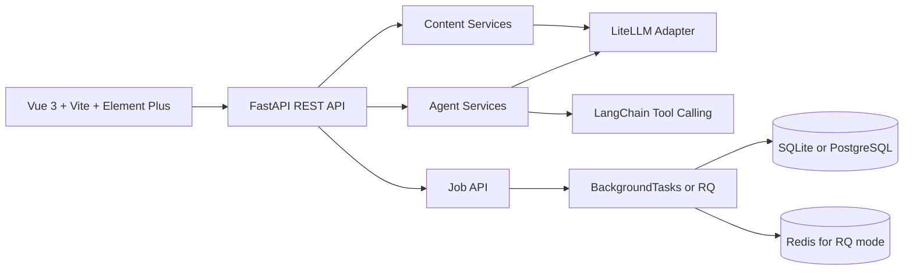

# AI Content Ops SaaS Prototype

[English](README.md) | [简体中文](README.zh-CN.md)

AI Content Ops is a demonstrable SaaS prototype for content operations teams. It combines a Vue 3 workspace, a FastAPI backend, multi-provider LLM routing, a 4-stage content Agent pipeline, a persistent tool-calling chat Agent, media-backed publishing flows, and job-backed content workflows.

The project is packaged as an AI full-stack engineering portfolio project: it shows product thinking, Agent orchestration, model integration, API contracts, and an end-to-end frontend workflow without claiming that it is already a production SaaS.

## Product Scope

The current product flow focuses on one practical content operations loop:

- Content Studio: run a Strategy / Writer / Editor / Review Agent pipeline and save the final draft.
- Agent Chat: use a persistent tool-calling Agent with model selection and thread history.
- Content Library: review saved drafts, generated variants, uploaded media, and local publication records.
- Refinement: polish an existing content item and save the revised version.
- Media and publishing: upload image/video assets and submit immediate or scheduled Xiaohongshu publishing jobs through the local MCP-backed integration path.
- Calendar: review a 60-day publishing queue with platform summaries, day-level agendas, and quick manual scheduling.
- Stats: view content distribution by type and status.
- Model Console: select Claude, SiliconFlow, DeepSeek, or Moonshot models through the same API surface.

There is intentionally no separate Campaigns workspace in the current UI. Content production stays in Studio, editing stays in Refinement, and planning/scheduling stays in Calendar and Agent Chat tools.

## Commercial Boundary

This repository is a demo-ready SaaS prototype.

It does not claim to include production-grade login, team permissions, billing, multi-tenant isolation, cloud deployment, or production social-account operations. The Xiaohongshu publishing path is a local MCP-backed prototype integration for demonstrating the workflow, not a hardened commercial publishing system. Those hardening layers are natural commercialization directions, but they are intentionally outside this version so the current implementation stays honest, reviewable, and runnable for interviews.

## Architecture



Core implementation areas:

- `frontend/`: Vue 3 application, Element Plus UI, polling-based job flows, and content/model API clients.
- `src/api/`: FastAPI routes, schemas, services, dependency injection, and contract-tested API behavior.
- `src/api/services/agent_pipeline.py`: 4-stage Agent pipeline for strategy, drafting, editing, and review.
- `src/api/services/chat_agent.py`: persistent chat Agent with content operations tools.
- `src/api/routes/jobs.py`: async job endpoints used by the Studio and Refine flows.
- `src/api/routes/media.py`: upload, list, serve, and delete local image/video assets with path-safety checks.
- `src/api/routes/publish.py` and `src/api/services/publish_service.py`: Xiaohongshu publication validation, queueing, immediate publishing, and scheduled publishing hooks.
- `src/jobs/`: queue adapter plus shared job runner for background mode and RQ workers.
- `src/llm/`: LiteLLM adapter used for Claude, SiliconFlow, DeepSeek, and Moonshot routing.
- `src/storage/content_store.py`: SQLAlchemy models and CRUD for content, media assets, publication records, calendar events, metrics, Agent threads, and jobs.
- `tests/`: contract tests for health, jobs, content generation, Agent pipeline, Agent chat persistence, tool events, media safety, publishing, and model listing.

## Screenshots

### Content Studio


### Refine Workspace


### Agent Chat


### Publishing Calendar

The Calendar page is an operational scheduling board: it summarizes the next 60 days, highlights today's planned posts, groups events by platform, and shows the selected day's agenda alongside the upcoming queue.

## Runtime Modes

This project supports two practical startup modes:

### 1. Local SQLite mode

Use this for local development, demos, and light concurrency.

- Database: SQLite
- Queue mode: FastAPI `BackgroundTasks`
- No Redis worker required

Prepared config file:

- `.env.sqlite`

### 2. Higher-concurrency PostgreSQL + Redis mode

Use this when you want the API to stay responsive while longer LLM tasks run in the background.

- Database: PostgreSQL
- Queue mode: Redis + RQ
- Requires a separate `worker.py` process

Prepared config file:

- `.env.postgres-rq`

Additional deployment notes live in [DEPLOYMENT.md](DEPLOYMENT.md).

## Portable Setup

Prerequisites:

- Python 3.10+
- Node.js 18+
- Docker Desktop if you want PostgreSQL + Redis locally
- An API key for at least one supported LLM provider if you want live generation. Demo seed data does not call external APIs.

Install backend dependencies:

```bash
python -m venv .venv

# Windows PowerShell
.\.venv\Scripts\Activate.ps1

# macOS / Linux
source .venv/bin/activate

python -m pip install -r requirements.txt
```

Install frontend dependencies:

```bash
cd frontend
npm install
cd ..
```

## Start With SQLite

Copy the prepared local config:

```bash
# PowerShell
Copy-Item .env.sqlite .env

# macOS / Linux
cp .env.sqlite .env
```

Then fill in the provider key you want to use inside `.env`.

Optional: seed demo data without calling any LLM provider:

```bash
python examples/seed_demo_data.py
```

Start the backend:

```bash
python server.py
```

Start the frontend in a second terminal:

```bash
cd frontend
npm run dev
```

Notes:

- SQLite data is stored in `data/content_ops.db`.
- In SQLite mode, do not start `python worker.py`.
- Agent/content jobs are executed through FastAPI background tasks.

## Start With PostgreSQL + Redis

Copy the higher-concurrency config:

```bash
# PowerShell
Copy-Item .env.postgres-rq .env

# macOS / Linux
cp .env.postgres-rq .env
```

Then fill in the provider key you want to use inside `.env`.

Start PostgreSQL and Redis:

```bash
docker compose up -d postgres redis
```

Start the API:

```bash
python server.py
```

For Linux or WSL, you can also run the API with multiple workers:

```bash
gunicorn -k uvicorn.workers.UvicornWorker src.api.main:app --workers 4 --bind 0.0.0.0:8000
```

Start the RQ worker in another terminal:

```bash
python worker.py
```

Start the frontend:

```bash
cd frontend
npm run dev
```

Notes:

- `docker-compose.yml` in this repo starts PostgreSQL and Redis only.
- On Windows, `worker.py` automatically uses RQ `SimpleWorker`.
- If Redis is not running, `python worker.py` will fail with a connection error. That is expected.

## Frontend Configuration

The frontend dev server uses `frontend/.env.example` as a reference. By default it proxies API traffic to:

```env
VITE_API_PROXY_TARGET=http://localhost:8000
```

Ports can be changed through `.env` for the API and `frontend/vite.config.ts` for the frontend dev server.

## Verification

```bash
python -m pytest tests -q
python -m compileall src tests examples

cd frontend
npm run build
```
