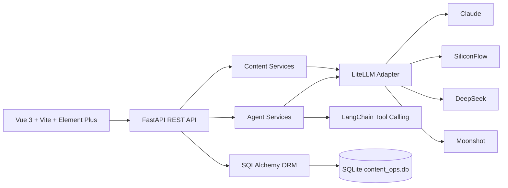

# AI Content Ops SaaS Prototype

AI Content Ops is a demonstrable SaaS prototype for content operations teams. It combines a Vue 3 workspace, a FastAPI backend, multi-provider LLM routing, a 4-stage content Agent pipeline, a tool-calling chat Agent, and persistent content operations data.

The project is packaged as an AI full-stack engineering portfolio project: it shows product thinking, Agent orchestration, model integration, API contracts, and an end-to-end frontend workflow without claiming that it is already a production SaaS.

## Product Scope

The current product flow focuses on one practical content operations loop:

- Content Studio: run a Strategy / Writer / Editor / Review Agent pipeline and save the final draft.
- Agent Chat: use a persistent tool-calling Agent with model selection and thread history.
- Content Library: review saved drafts and generated variants.
- Refinement: polish an existing content item and save the revised version.
- Calendar: schedule saved content for future publishing dates.
- Stats: view content distribution by type and status.
- Model Console: select Claude, SiliconFlow, DeepSeek, or Moonshot models through the same API surface.

## Commercial Boundary

This repository is a local, demo-ready SaaS prototype.

It does not claim to include production-grade login, team permissions, billing, multi-tenant isolation, cloud deployment, or real publishing integrations. Those are natural commercialization directions, but they are intentionally outside this version so the current implementation stays honest, reviewable, and runnable for interviews.

## Architecture



Core implementation areas:

- `frontend/`: Vue 3 application, Element Plus UI, ECharts stats, and model/content API clients.
- `src/api/`: FastAPI routes, schemas, services, dependency injection, and contract-tested API behavior.
- `src/api/services/agent_pipeline.py`: 4-stage Agent pipeline for strategy, drafting, editing, and review.
- `src/api/services/chat_agent.py`: persistent chat Agent with 9 content operations tools.
- `src/llm/`: LiteLLM adapter used for Claude, SiliconFlow, DeepSeek, and Moonshot routing.
- `src/storage/content_store.py`: SQLAlchemy models and CRUD for content, calendar events, metrics, and Agent threads.
- `tests/`: contract tests for health, content generation, Agent pipeline, Agent chat persistence, tool events, and model listing.

## Local Demo

Prerequisites:

- Python 3.10+
- Node.js 18+
- A provider API key only if you want to run live LLM generation. Seeded demo data does not call external APIs.

Install Python dependencies:

```powershell
conda activate only
pip install -r requirements.txt
```

Create local configuration:

```powershell
Copy-Item .env.example .env
```

Set the provider you want to use in `.env`, for example:

```env
LLM_PROVIDER=siliconflow
SILICONFLOW_API_KEY=your_key_here
DATABASE_URL=sqlite:///./data/content_ops.db
```

Seed local demo data without calling any LLM provider:

```powershell
python examples/seed_demo_data.py
```

Start the backend:

```powershell
python server.py
```

Start the frontend in a second terminal:

```powershell
cd frontend
npm install
npm run dev
```

Open the app:

- Frontend: `http://localhost:5173`
- Backend health check: `http://localhost:8000/api/health`
- API docs: `http://localhost:8000/docs`

The seed script is safe to run repeatedly. It removes only rows marked with the demo provider/model before inserting fresh content, calendar events, metrics, and a sample Agent thread.

## Current Startup

Run the backend:

```powershell
python server.py
```

Run the frontend:

```powershell
cd frontend
npm run dev
```

Optional demo data reset:

```powershell
python examples/seed_demo_data.py
```

Run verification:

```powershell
F:\miniconda\envs\only\python.exe -m pytest tests -q
F:\miniconda\envs\only\python.exe -m compileall src tests examples
cd frontend
npm.cmd run build
```

## API Surface

Primary REST endpoints:

- `GET /api/health`: backend health check.
- `GET /api/models`: configured provider and model options.
- `POST /api/agent/run`: run the 4-stage content pipeline.
- `POST /api/agent/chat`: run the persistent tool-calling Agent.
- `GET /api/agent/threads`: list persisted Agent conversations.
- `GET /api/content`: list saved content.
- `POST /api/content/generate`: generate and save a draft.
- `POST /api/content/refine`: refine and save a content variant.
- `GET /api/calendar/events`: view scheduled content.
- `POST /api/calendar/events`: schedule content.
- `GET /api/stats`: content count distribution by type and status.

## Resume Positioning

Use this project as an AI full-stack engineering case study, not as a claim of a mature commercial SaaS. Good keywords include:

- Agent orchestration
- Tool-calling Agent
- LLM integration
- Multi-provider model routing
- FastAPI
- Vue 3
- SQLAlchemy
- Contract tests
- Content workflow automation

See [RESUME.md](RESUME.md) for resume-ready Chinese and English bullets, and [DEMO.md](DEMO.md) for a 3-5 minute interview demo script.
