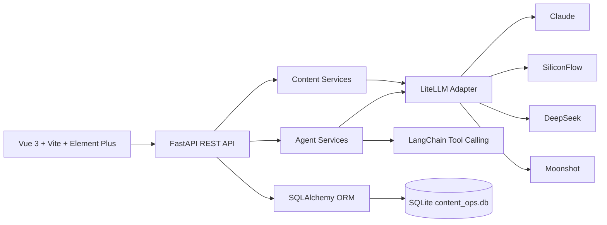

# AI Content Ops SaaS Prototype

Language: [English](#english) | [中文](#中文)

---

## English

AI Content Ops is a demonstrable SaaS prototype for content operations teams. It combines a Vue 3 workspace, a FastAPI backend, multi-provider LLM routing, a 4-stage content Agent pipeline, a tool-calling chat Agent, and persistent content operations data.

The project is packaged as an AI full-stack engineering portfolio project: it shows product thinking, Agent orchestration, model integration, API contracts, and an end-to-end frontend workflow without claiming that it is already a production SaaS.

### Product Scope

The current product flow focuses on one practical content operations loop:

- Content Studio: run a Strategy / Writer / Editor / Review Agent pipeline and save the final draft.
- Agent Chat: use a persistent tool-calling Agent with model selection and thread history.
- Content Library: review saved drafts and generated variants.
- Refinement: polish an existing content item and save the revised version.
- Calendar: schedule saved content for future publishing dates.
- Stats: view content distribution by type and status.
- Model Console: select Claude, SiliconFlow, DeepSeek, or Moonshot models through the same API surface.

### Commercial Boundary

This repository is a demo-ready SaaS prototype.

It does not claim to include production-grade login, team permissions, billing, multi-tenant isolation, cloud deployment, or real publishing integrations. Those are natural commercialization directions, but they are intentionally outside this version so the current implementation stays honest, reviewable, and runnable for interviews.

### Architecture



Core implementation areas:

- `frontend/`: Vue 3 application, Element Plus UI, ECharts stats, and model/content API clients.
- `src/api/`: FastAPI routes, schemas, services, dependency injection, and contract-tested API behavior.
- `src/api/services/agent_pipeline.py`: 4-stage Agent pipeline for strategy, drafting, editing, and review.
- `src/api/services/chat_agent.py`: persistent chat Agent with 9 content operations tools.
- `src/llm/`: LiteLLM adapter used for Claude, SiliconFlow, DeepSeek, and Moonshot routing.
- `src/storage/content_store.py`: SQLAlchemy models and CRUD for content, calendar events, metrics, and Agent threads.
- `tests/`: contract tests for health, content generation, Agent pipeline, Agent chat persistence, tool events, and model listing.

### Portable Setup

Prerequisites:

- Python 3.10+
- Node.js 18+
- An API key for at least one supported LLM provider if you want live generation. Demo seed data does not call external APIs.

Install backend dependencies:

```bash
python -m venv .venv

# Windows PowerShell
.\.venv\Scripts\Activate.ps1

# macOS / Linux
source .venv/bin/activate

python -m pip install -r requirements.txt
```

Create runtime configuration from the example file:

```bash
cp .env.example .env
```

If your shell does not provide `cp`, copy `.env.example` to `.env` with your system's file copy command. Then set the provider key you want to use.

Optional: seed demo data without calling any LLM provider:

```bash
python examples/seed_demo_data.py
```

Start the backend:

```bash
python server.py
```

Start the frontend in a second terminal:

```bash
cd frontend
npm install
npm run dev
```

The backend and frontend URLs are printed in your terminal when the servers start. Ports can be changed through `.env` for the API and `frontend/vite.config.ts` for the frontend dev server. Open the API docs by visiting `/docs` on the backend server URL.

### Verification

```bash
python -m pytest tests -q
python -m compileall src tests examples

cd frontend
npm run build
```

### API Surface

- `GET /api/health`: backend health check.
- `GET /api/models`: configured provider and model options.
- `POST /api/agent/run`: run the 4-stage content pipeline.
- `POST /api/agent/chat`: run the persistent tool-calling Agent.
- `GET /api/agent/threads`: list persisted Agent conversations.
- `GET /api/content`: list saved content.
- `POST /api/content/generate`: generate and save a draft.
- `POST /api/content/refine`: refine and save a content variant.
- `GET /api/calendar/events`: view scheduled content.
- `POST /api/calendar/events`: schedule content.
- `GET /api/stats`: content count distribution by type and status.

### Resume Positioning

Use this project as an AI full-stack engineering case study, not as a claim of a mature commercial SaaS. Good keywords include Agent orchestration, tool-calling Agent, LLM integration, multi-provider model routing, FastAPI, Vue 3, SQLAlchemy, and contract tests.

See [RESUME.md](RESUME.md) for resume-ready Chinese and English bullets, and [DEMO.md](DEMO.md) for a 3-5 minute interview demo script.

---

## 中文

AI Content Ops 是一个可演示的 AI 内容运营 SaaS 原型。项目把 Vue 3 内容工作台、FastAPI 后端、多模型路由、四阶段 Agent pipeline、工具型对话 Agent 和内容运营数据持久化串成一个完整闭环。

这个项目适合作为 AI 全栈工程师作品集项目：重点展示产品闭环、Agent 编排、LLM 接入、API contract tests 和端到端前后端实现。它不是已经上线的生产级 SaaS，也不夸大为已有真实商业收入的产品。

### 产品范围

当前版本围绕内容运营的核心流程展开：

- 内容工作台：运行 Strategy / Writer / Editor / Review 四阶段 Agent pipeline，并保存最终稿。
- Agent 对话：支持模型选择、thread 持久化和工具调用记录。
- 内容库：查看历史内容和生成版本。
- 内容打磨：对已有内容进行优化并保存新版本。
- 发布日历：为内容安排未来发布时间。
- 统计分析：查看内容类型和状态分布。
- 模型选择：通过同一套 API 支持 Claude、SiliconFlow、DeepSeek、Moonshot。

### 商业化边界

本仓库是一个可演示的 SaaS 原型。

当前版本不包含生产级登录、团队权限、计费、多租户隔离、云部署或真实平台发布集成。这些是后续商业化方向，但不是当前实现范围。这样可以保证项目表达准确，适合面试和代码审查。

### 技术架构


核心目录：

- `frontend/`：Vue 3 前端、Element Plus UI、ECharts 统计图和 API client。
- `src/api/`：FastAPI 路由、Pydantic schema、依赖注入和服务层。
- `src/api/services/agent_pipeline.py`：Strategy / Writer / Editor / Review 四阶段 Agent pipeline。
- `src/api/services/chat_agent.py`：支持 9 个内容运营工具的持久化对话 Agent。
- `src/llm/`：基于 LiteLLM 的多 provider 模型适配。
- `src/storage/content_store.py`：SQLAlchemy 持久化内容、日历、指标、Agent thread 和消息。
- `tests/`：覆盖健康检查、内容生成、Agent pipeline、Agent chat、tool events 和模型列表的 contract tests。

### 通用启动方式

环境要求：

- Python 3.10+
- Node.js 18+
- 如果要调用真实模型，需要配置至少一个 LLM provider 的 API key。演示数据脚本不会调用外部 API。

安装后端依赖：

```bash
python -m venv .venv

# Windows PowerShell
.\.venv\Scripts\Activate.ps1

# macOS / Linux
source .venv/bin/activate

python -m pip install -r requirements.txt
```

从示例文件创建运行配置：

```bash
cp .env.example .env
```

如果当前 shell 没有 `cp` 命令，可以用系统自带的复制命令把 `.env.example` 复制成 `.env`。然后在 `.env` 里填写你要使用的 provider API key。

可选：导入演示数据，不调用外部 LLM：

```bash
python examples/seed_demo_data.py
```

启动后端：

```bash
python server.py
```

另开一个终端启动前端：

```bash
cd frontend
npm install
npm run dev
```

后端和前端服务地址会在启动成功后显示在终端里。API 端口可以通过 `.env` 配置，前端开发端口可以在 `frontend/vite.config.ts` 中调整。API 文档地址是在后端服务地址后追加 `/docs`。

### 验证命令

```bash
python -m pytest tests -q
python -m compileall src tests examples

cd frontend
npm run build
```

### API 接口

- `GET /api/health`：后端健康检查。
- `GET /api/models`：查看 provider 和模型配置。
- `POST /api/agent/run`：运行四阶段内容 Agent pipeline。
- `POST /api/agent/chat`：运行工具型对话 Agent。
- `GET /api/agent/threads`：查看持久化对话 thread。
- `GET /api/content`：查看内容库。
- `POST /api/content/generate`：生成并保存内容草稿。
- `POST /api/content/refine`：打磨并保存内容新版本。
- `GET /api/calendar/events`：查看发布日历。
- `POST /api/calendar/events`：安排内容发布时间。
- `GET /api/stats`：查看内容类型和状态分布。

### 简历定位

这个项目适合作为 AI 全栈工程师项目，而不是宣传成成熟商业 SaaS。推荐关键词包括 Agent orchestration、tool-calling Agent、LLM integration、multi-provider model routing、FastAPI、Vue 3、SQLAlchemy 和 contract tests。

简历版项目描述见 [RESUME.md](RESUME.md)，3-5 分钟面试演示路线见 [DEMO.md](DEMO.md)。
