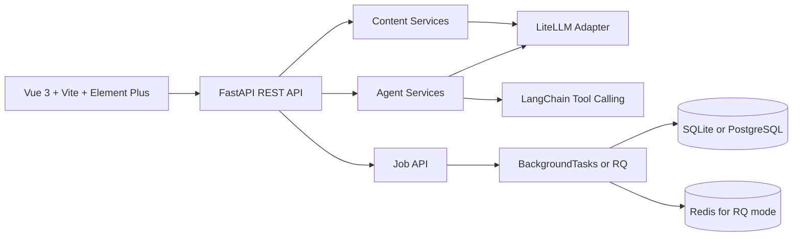

# AI Content Ops SaaS Prototype

[English](README.md) | [简体中文](README.zh-CN.md)

AI Content Ops is a demonstrable SaaS prototype for content operations teams. It combines a Vue 3 workspace, a FastAPI backend, multi-provider LLM routing, a 4-stage content Agent pipeline, a persistent tool-calling chat Agent, and job-backed content workflows.

The project is packaged as an AI full-stack engineering portfolio project: it shows product thinking, Agent orchestration, model integration, API contracts, and an end-to-end frontend workflow without claiming that it is already a production SaaS.

## Product Scope

The current product flow focuses on one practical content operations loop:

- Content Studio: run a Strategy / Writer / Editor / Review Agent pipeline and save the final draft.
- Agent Chat: use a persistent tool-calling Agent with model selection and thread history.
- Content Library: review saved drafts and generated variants.
- Refinement: polish an existing content item and save the revised version.
- Calendar: schedule saved content for future publishing dates.
- Stats: view content distribution by type and status.
- Model Console: select Claude, SiliconFlow, DeepSeek, or Moonshot models through the same API surface.

## Commercial Boundary

This repository is a demo-ready SaaS prototype.

It does not claim to include production-grade login, team permissions, billing, multi-tenant isolation, cloud deployment, or real publishing integrations. Those are natural commercialization directions, but they are intentionally outside this version so the current implementation stays honest, reviewable, and runnable for interviews.

## Architecture



Core implementation areas:

- `frontend/`: Vue 3 application, Element Plus UI, polling-based job flows, and content/model API clients.
- `src/api/`: FastAPI routes, schemas, services, dependency injection, and contract-tested API behavior.
- `src/api/services/agent_pipeline.py`: 4-stage Agent pipeline for strategy, drafting, editing, and review.
- `src/api/services/chat_agent.py`: persistent chat Agent with content operations tools.
- `src/api/routes/jobs.py`: async job endpoints used by the Studio and Refine flows.
- `src/jobs/`: queue adapter plus shared job runner for background mode and RQ workers.
- `src/llm/`: LiteLLM adapter used for Claude, SiliconFlow, DeepSeek, and Moonshot routing.
- `src/storage/content_store.py`: SQLAlchemy models and CRUD for content, calendar events, metrics, Agent threads, and jobs.
- `tests/`: contract tests for health, jobs, content generation, Agent pipeline, Agent chat persistence, tool events, and model listing.

## Runtime Modes

This project supports two practical startup modes:

### 1. Local SQLite mode

Use this for local development, demos, and light concurrency.

- Database: SQLite
- Queue mode: FastAPI `BackgroundTasks`
- No Redis worker required

Prepared config file:

- `.env.sqlite`

### 2. Higher-concurrency PostgreSQL + Redis mode

Use this when you want the API to stay responsive while longer LLM tasks run in the background.

- Database: PostgreSQL
- Queue mode: Redis + RQ
- Requires a separate `worker.py` process

Prepared config file:

- `.env.postgres-rq`

Additional deployment notes live in [DEPLOYMENT.md](DEPLOYMENT.md).

## Portable Setup

Prerequisites:

- Python 3.10+
- Node.js 18+
- Docker Desktop if you want PostgreSQL + Redis locally
- An API key for at least one supported LLM provider if you want live generation. Demo seed data does not call external APIs.

Install backend dependencies:

```bash
python -m venv .venv

# Windows PowerShell
.\.venv\Scripts\Activate.ps1

# macOS / Linux
source .venv/bin/activate

python -m pip install -r requirements.txt
```

Install frontend dependencies:

```bash
cd frontend
npm install
cd ..
```

## Start With SQLite

Copy the prepared local config:

```bash
# PowerShell
Copy-Item .env.sqlite .env

# macOS / Linux
cp .env.sqlite .env
```

Then fill in the provider key you want to use inside `.env`.

Optional: seed demo data without calling any LLM provider:

```bash
python examples/seed_demo_data.py
```

Start the backend:

```bash
python server.py
```

Start the frontend in a second terminal:

```bash
cd frontend
npm run dev
```

Notes:

- SQLite data is stored in `data/content_ops.db`.
- In SQLite mode, do not start `python worker.py`.
- Agent/content jobs are executed through FastAPI background tasks.

## Start With PostgreSQL + Redis

Copy the higher-concurrency config:

```bash
# PowerShell
Copy-Item .env.postgres-rq .env

# macOS / Linux
cp .env.postgres-rq .env
```

Then fill in the provider key you want to use inside `.env`.

Start PostgreSQL and Redis:

```bash
docker compose up -d postgres redis
```

Start the API:

```bash
python server.py
```

For Linux or WSL, you can also run the API with multiple workers:

```bash
gunicorn -k uvicorn.workers.UvicornWorker src.api.main:app --workers 4 --bind 0.0.0.0:8000
```

Start the RQ worker in another terminal:

```bash
python worker.py
```

Start the frontend:

```bash
cd frontend
npm run dev
```

Notes:

- `docker-compose.yml` in this repo starts PostgreSQL and Redis only.
- On Windows, `worker.py` automatically uses RQ `SimpleWorker`.
- If Redis is not running, `python worker.py` will fail with a connection error. That is expected.

## Frontend Configuration

The frontend dev server uses `frontend/.env.example` as a reference. By default it proxies API traffic to:

```env
VITE_API_PROXY_TARGET=http://localhost:8000
```

Ports can be changed through `.env` for the API and `frontend/vite.config.ts` for the frontend dev server.

## Verification

```bash
python -m pytest tests -q
python -m compileall src tests examples

cd frontend
npm run build
```

## API Surface

Synchronous API endpoints:

- `GET /api/health`: backend health check.
- `GET /api/models`: configured provider and model options.
- `POST /api/agent/run`: run the 4-stage content pipeline directly.
- `POST /api/agent/chat`: run the persistent tool-calling Agent.
- `GET /api/agent/threads`: list persisted Agent conversations.
- `GET /api/agent/threads/{thread_id}/messages`: list messages for one Agent thread.
- `DELETE /api/agent/threads/{thread_id}`: delete a persisted Agent thread.
- `GET /api/content`: list saved content.
- `GET /api/content/{content_id}`: fetch one saved content item.
- `POST /api/content/generate`: generate and save a draft directly.
- `POST /api/content/refine`: refine and save a content variant directly.
- `POST /api/content/titles`: generate title options.
- `POST /api/content/seo`: generate SEO suggestions.
- `GET /api/calendar/events`: view scheduled content.
- `POST /api/calendar/events`: schedule content.
- `GET /api/stats`: content count distribution by type and status.

Job-backed API endpoints:

- `POST /api/jobs/content-generation`: enqueue content generation.
- `POST /api/jobs/agent-run`: enqueue the 4-stage Agent pipeline.
- `POST /api/jobs/refine`: enqueue a refine job.
- `POST /api/jobs/titles`: enqueue title generation.
- `POST /api/jobs/seo`: enqueue SEO analysis.
- `GET /api/jobs/{job_id}`: poll a job status/result.

## Resume Positioning

Use this project as an AI full-stack engineering case study, not as a claim of a mature commercial SaaS. Good keywords include Agent orchestration, tool-calling Agent, LLM integration, multi-provider model routing, FastAPI, Vue 3, SQLAlchemy, Redis, RQ, and contract tests.

See [RESUME.md](RESUME.md) for resume-ready Chinese and English bullets, and [DEMO.md](DEMO.md) for a 3-5 minute interview demo script.
