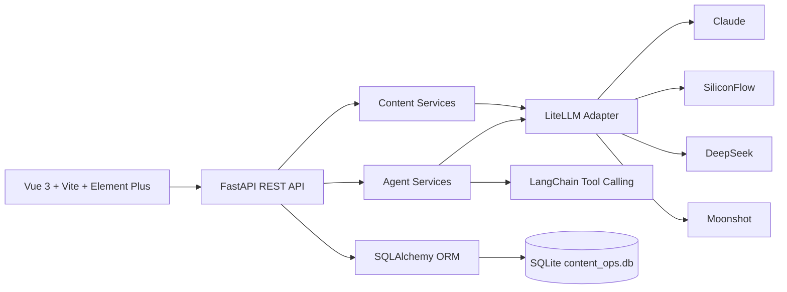

# AI Content Ops SaaS Prototype

[English](README.md) | [简体中文](README.zh-CN.md)

AI Content Ops is a demonstrable SaaS prototype for content operations teams. It combines a Vue 3 workspace, a FastAPI backend, multi-provider LLM routing, a 4-stage content Agent pipeline, a tool-calling chat Agent, and persistent content operations data.

The project is packaged as an AI full-stack engineering portfolio project: it shows product thinking, Agent orchestration, model integration, API contracts, and an end-to-end frontend workflow without claiming that it is already a production SaaS.

## Product Scope

The current product flow focuses on one practical content operations loop:

- Content Studio: run a Strategy / Writer / Editor / Review Agent pipeline and save the final draft.
- Agent Chat: use a persistent tool-calling Agent with model selection and thread history.
- Content Library: review saved drafts and generated variants.
- Refinement: polish an existing content item and save the revised version.
- Calendar: schedule saved content for future publishing dates.
- Stats: view content distribution by type and status.
- Model Console: select Claude, SiliconFlow, DeepSeek, or Moonshot models through the same API surface.

## Commercial Boundary

This repository is a demo-ready SaaS prototype.

It does not claim to include production-grade login, team permissions, billing, multi-tenant isolation, cloud deployment, or real publishing integrations. Those are natural commercialization directions, but they are intentionally outside this version so the current implementation stays honest, reviewable, and runnable for interviews.

## Architecture



Core implementation areas:

- `frontend/`: Vue 3 application, Element Plus UI, ECharts stats, and model/content API clients.
- `src/api/`: FastAPI routes, schemas, services, dependency injection, and contract-tested API behavior.
- `src/api/services/agent_pipeline.py`: 4-stage Agent pipeline for strategy, drafting, editing, and review.
- `src/api/services/chat_agent.py`: persistent chat Agent with 9 content operations tools.
- `src/llm/`: LiteLLM adapter used for Claude, SiliconFlow, DeepSeek, and Moonshot routing.
- `src/storage/content_store.py`: SQLAlchemy models and CRUD for content, calendar events, metrics, and Agent threads.
- `tests/`: contract tests for health, content generation, Agent pipeline, Agent chat persistence, tool events, and model listing.

## Portable Setup

Prerequisites:

- Python 3.10+
- Node.js 18+
- An API key for at least one supported LLM provider if you want live generation. Demo seed data does not call external APIs.

Install backend dependencies:

```bash
python -m venv .venv

# Windows PowerShell
.\.venv\Scripts\Activate.ps1

# macOS / Linux
source .venv/bin/activate

python -m pip install -r requirements.txt
```

Create runtime configuration from the example file:

```bash
cp .env.example .env
```

If your shell does not provide `cp`, copy `.env.example` to `.env` with your system's file copy command. Then set the provider key you want to use.

Optional: seed demo data without calling any LLM provider:

```bash
python examples/seed_demo_data.py
```

Start the backend:

```bash
python server.py
```

Start the frontend in a second terminal:

```bash
cd frontend
npm install
npm run dev
```

The backend and frontend URLs are printed in your terminal when the servers start. Ports can be changed through `.env` for the API and `frontend/vite.config.ts` for the frontend dev server. Open the API docs by visiting `/docs` on the backend server URL.

## Verification

```bash
python -m pytest tests -q
python -m compileall src tests examples

cd frontend
npm run build
```

## API Surface

- `GET /api/health`: backend health check.
- `GET /api/models`: configured provider and model options.
- `POST /api/agent/run`: run the 4-stage content pipeline.
- `POST /api/agent/chat`: run the persistent tool-calling Agent.
- `GET /api/agent/threads`: list persisted Agent conversations.
- `GET /api/content`: list saved content.
- `POST /api/content/generate`: generate and save a draft.
- `POST /api/content/refine`: refine and save a content variant.
- `GET /api/calendar/events`: view scheduled content.
- `POST /api/calendar/events`: schedule content.
- `GET /api/stats`: content count distribution by type and status.

## Resume Positioning

Use this project as an AI full-stack engineering case study, not as a claim of a mature commercial SaaS. Good keywords include Agent orchestration, tool-calling Agent, LLM integration, multi-provider model routing, FastAPI, Vue 3, SQLAlchemy, and contract tests.

See [RESUME.md](RESUME.md) for resume-ready Chinese and English bullets, and [DEMO.md](DEMO.md) for a 3-5 minute interview demo script.
