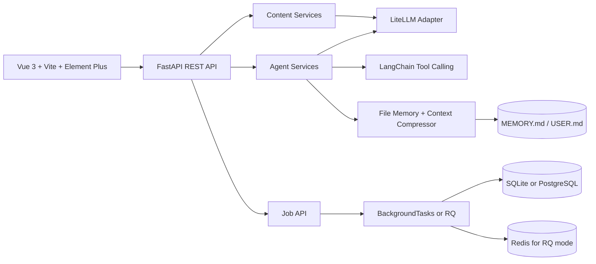
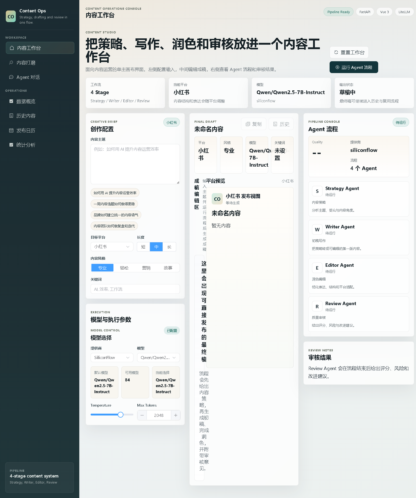
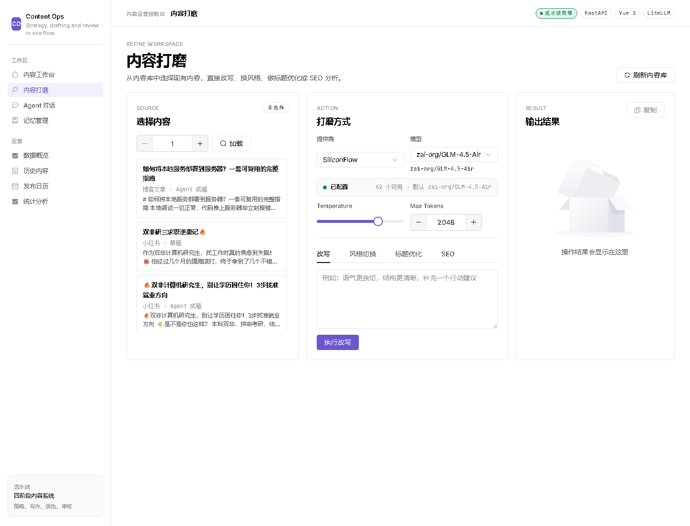
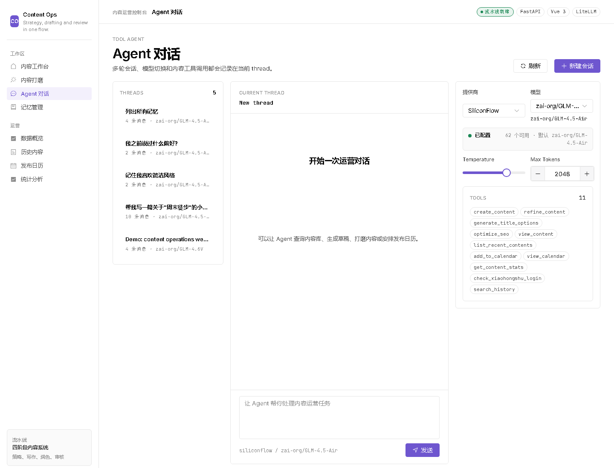
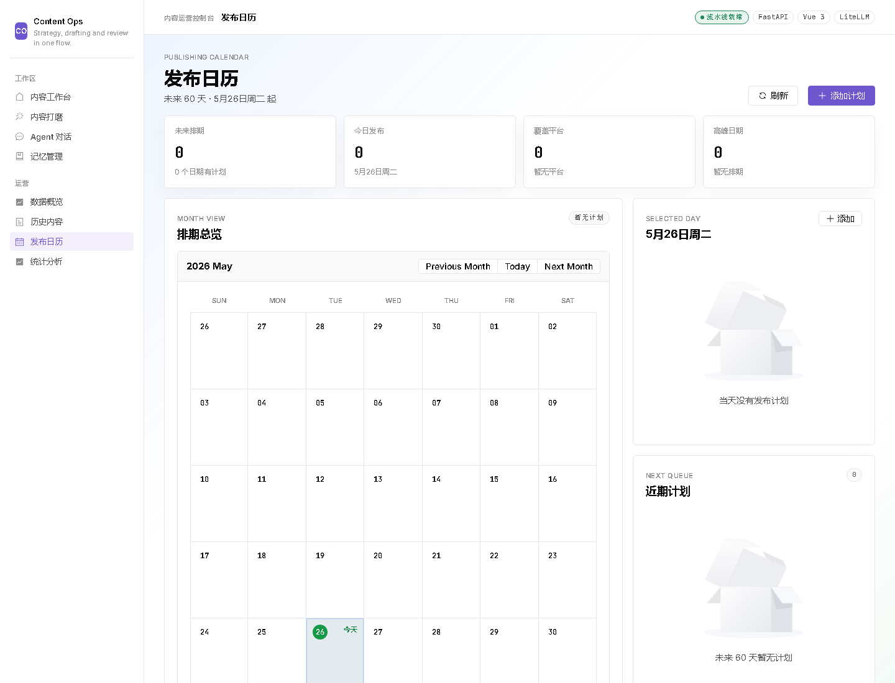

# AI Content Ops SaaS Prototype

[English](README.md) | [简体中文](README.zh-CN.md)

AI Content Ops 是一个面向内容运营团队的可演示 SaaS 原型。项目把 Vue 3 工作台、FastAPI 后端、多模型路由、四阶段内容 Agent 流程、持久化工具型对话 Agent、带素材的发布流程，以及基于任务的内容工作流组合成一个完整闭环。

这个项目更适合作为 AI 全栈工程作品集项目：重点展示产品思考、Agent 编排、模型接入、API 契约测试和前后端联动，而不是把它描述成已经成熟商用的 SaaS。

## 产品范围

当前版本围绕一条实用的内容运营主流程展开：

- 内容工作台：运行 Strategy / Writer / Editor / Review 四阶段 Agent 流程，并保存最终稿。
- Agent 对话：支持模型选择、线程持久化和工具调用记录。
- 内容库：查看历史内容、生成版本、上传素材和本地发布记录。
- 内容打磨：对已有内容进行改写、换风格并保存新版本。
- 素材与发布：上传图片/视频素材，并通过本地 MCP 集成路径提交小红书立即发布或定时发布任务。
- 发布日历：查看未来 60 天发布队列、平台分布、单日议程，并支持快速手动排期。
- 统计分析：查看内容类型和状态分布。
- 模型控制台：通过同一套 API 使用 Claude、SiliconFlow、DeepSeek、Moonshot，以及任意 NewAPI 兼容网关。
- 长期记忆：Hermes 风格的文件型记忆层（`MEMORY.md` + `USER.md`），配合会话内上下文压缩器和线程关闭后的自动 curator。详见下方 [长期记忆](#长期记忆) 章节。

当前 UI 中没有单独的 Campaigns / 内容活动工作区。内容生产留在内容工作台，内容修改留在内容打磨，计划和排期留在发布日历与 Agent 工具里。

## 商业化边界

这个仓库是一个适合演示和面试的 SaaS 原型。

当前版本不包含生产级登录、团队权限、计费、多租户隔离、云部署或生产级社交账号运营能力。小红书发布路径是基于本地 MCP 的原型集成，用于展示工作流，不等同于已经加固过的商业发布系统。这些加固层是后续商业化方向，但不在当前实现范围内，这样可以保证项目表述准确、代码可审查、运行门槛可控。

## 技术架构



核心目录：

- `frontend/`: Vue 3 前端、Element Plus 界面、基于轮询的任务流和内容/模型 API client。
- `src/api/`: FastAPI 路由、schema、服务层、依赖注入和契约测试接口。
- `src/api/services/agent_pipeline.py`: 四阶段 Agent 流程，负责策略、初稿、润色和审核。
- `src/api/services/chat_agent.py`: 持久化的工具型对话 Agent，内置内容运营工具、文件记忆工具（`memory_add` / `memory_replace` / `memory_remove`），以及基于 FTS5 的 `session_search` 全文检索工具。
- `src/api/routes/jobs.py`: 工作台和打磨页使用的异步任务接口。
- `src/api/routes/media.py`: 本地图片/视频素材的上传、列表、访问和删除，并包含文件路径安全检查。
- `src/api/routes/publish.py` 和 `src/api/services/publish_service.py`: 小红书发布校验、任务入队、立即发布和定时发布挂钩。
- `src/api/routes/memory.py`: 直接读写 `MEMORY.md` / `USER.md`、FTS5 会话检索，以及 frozen-snapshot 失效接口。
- `src/agent/`: 会话内上下文压缩器（Hermes 第 4 层）和线程关闭后的记忆 curator（Hermes 第 3 层）。
- `src/storage/file_memory.py`: 线程安全的 `MEMORY.md` / `USER.md` 读写器，带硬字符上限。
- `src/jobs/`: 队列适配层和共享任务执行器，兼容 background 模式和 RQ worker。
- `src/llm/`: 基于 LiteLLM 的 Claude、SiliconFlow、DeepSeek、Moonshot、NewAPI 多 provider 适配。
- `src/storage/content_store.py`: SQLAlchemy 持久化内容、素材、发布记录、日历、统计、Agent 会话和任务状态。
- `tests/`: 健康检查、任务接口、内容生成、Agent 流程、对话持久化、工具事件、素材安全、发布流程、模型列表、文件记忆、记忆 curator、上下文压缩器、chat agent 记忆集成、会话搜索的契约测试。

## 长期记忆

对话 Agent 内置了一个 Hermes 风格的四层长期记忆系统，每一层都可通过环境变量单独关闭——如果你不需要记忆，可以一直收缩到一个无状态的 chat Agent。

| 层 | 位置 | 作用 |
|----:|------|------|
| 1 | `data/memory/MEMORY.md` + `data/memory/USER.md` | 两个 flat markdown 文件，带硬字符上限（默认 2200 / 1375）。`MEMORY.md` 是 Agent 自己的笔记本（项目惯例、品牌词、工具坑），`USER.md` 是用户画像（姓名、语言、风格偏好）。 |
| 2 | `src/api/services/chat_agent.py` | 每个 thread 启动时把两个文件**一次性冻结**进系统 prompt，整个 session 不再重读——目的是让 Anthropic prompt caching 保暖。Agent 拥有 `memory_add` / `memory_replace` / `memory_remove` 工具来写入文件，但所有改动**下次 session 才生效**，不影响当前对话。 |
| 3 | `src/agent/memory_curator.py` | 用户删除会话（`DELETE /api/agent/threads/{id}`）时，后台用辅助 LLM 跑一遍完整 transcript + 当前文件，输出一组 `add` / `replace` / `remove` 操作。单个操作失败（超限、匹配歧义）会被记录，但不会拖垮整批。 |
| 4 | `src/agent/context_compressor.py` | 会话消息超过阈值（默认 30 条）时，把中间段交给辅助 LLM 压缩成 13 段固定结构的 markdown checkpoint。Tool call ↔ tool result 配对会被保护，分界永远不会切到一半。后续轮次检测到已有 checkpoint，会改用迭代 prompt 在原地更新。 |

前端"长期记忆"页是这两个文件的直接编辑器，带字符占用进度条。进阶接口有 `POST /api/memory/refresh-snapshot`（主动失效单个或全部 thread 的 frozen 缓存），以及 `POST /api/memory/search`（FTS5 trigram 全文搜索 `agent_messages`——支持中文 ≥ 3 字符，短查询自动回退到 LIKE）。

### 记忆相关环境变量

默认值对单用户 demo 已经够用；需要时在 `.env` 里调：

```env
MEMORY_ENABLED=true                       # 第 1-3 层总开关
MEMORY_DIR=data/memory                    # MEMORY.md / USER.md 存放目录
MEMORY_MD_LIMIT=2200                      # MEMORY.md 硬字符上限
USER_MD_LIMIT=1375                        # USER.md 硬字符上限
CONTEXT_COMPRESS_ENABLED=true             # 第 4 层
CONTEXT_COMPRESS_TRIGGER_MESSAGES=30      # 消息数超过该阈值触发压缩
CONTEXT_COMPRESS_KEEP_HEAD=4              # 头部保留原文条数
CONTEXT_COMPRESS_KEEP_TAIL=8              # 尾部保留原文条数
MEMORY_CURATOR_ENABLED=true               # 第 3 层
MEMORY_CURATOR_MIN_MESSAGES=4             # 太短的 thread 不 curate
MEMORY_CURATOR_MAX_ACTIONS=6              # 每个关闭 thread 最多写多少条
```

### 从旧版向量记忆迁移

更早版本把记忆存为 `agent_memories` 表里的行，并在 `data/chroma/` 下保留 embedding。这两块已经下线。如果你在升级已有数据库，**重新部署前**先跑一次性迁移脚本：

```bash
python examples/migrate_memories.py --db data/content_ops.db --memory-dir data/memory
# 加 --dry-run 可以只预览分桶结果，不写文件
```

脚本会读 `agent_memories`，把 `preference` 类别落进 `USER.md`，其余落进 `MEMORY.md`；超出字符上限的条目写到 `data/memory/_overflow_<timestamp>.md` 供人工挑选合并。脚本不会动 `agent_memories` 表和 `data/chroma/` 目录，确认迁移成功后由你自己删除。

## 界面截图

### 内容工作台



### 内容打磨



### Agent 对话



### 发布日历



发布日历现在是一个运营排期看板：汇总未来 60 天计划，突出今日发布，按平台显示排期，并在右侧展示选中日期议程和近期队列。

## 运行模式

项目目前支持两种实际可用的启动方式：

### 1. 本地 SQLite 模式

适合本地开发、演示和轻并发场景。

- 数据库：SQLite
- 队列模式：FastAPI `BackgroundTasks`
- 不需要 Redis worker

现成配置文件：

- `.env.sqlite`

### 2. PostgreSQL + Redis 高并发模式

适合希望 API 保持响应，而较长的 LLM 任务转后台执行的场景。

- 数据库：PostgreSQL
- 队列模式：Redis + RQ
- 需要单独启动 `worker.py`

现成配置文件：

- `.env.postgres-rq`

额外部署说明见 [DEPLOYMENT.md](DEPLOYMENT.md)。

### Docker Compose 完整栈

仓库使用一个多阶段 `Dockerfile` 加 `docker-compose.yml` 启动完整栈：Vue/Nginx 前端、FastAPI API、RQ worker、PostgreSQL 和 Redis。

```bash
cp .env.docker.example .env
docker compose up --build
```

打开 `http://localhost:8088`。Docker 模式默认使用 PostgreSQL + Redis/RQ。需要登录保护时，在 `.env` 里设置 `AUTH_ENABLED=true`、`AUTH_PASSWORD` 和 `AUTH_SECRET_KEY`。

研究型 Pipeline 的网页检索建议配置稳定搜索 API。在 `.env` 中填入 `SERPER_API_KEY`、`TAVILY_API_KEY` 或 `BRAVE_SEARCH_API_KEY` 任意一个即可；不填时会退回到无 key 的 HTML 搜索，可能被搜索引擎反爬限制。

常用命令：

```bash
docker compose ps
docker compose logs -f api
docker compose down
```

## 通用安装

环境要求：

- Python 3.10+
- Node.js 18+
- 如果你要启动完整 Compose 栈，或只在本地起 PostgreSQL + Redis，需要 Docker Desktop
- 如果要调用真实模型，至少需要配置一个可用的 LLM provider API key。演示数据脚本不会调用外部模型。

安装后端依赖：

```bash
python -m venv .venv

# Windows PowerShell
.\.venv\Scripts\Activate.ps1

# macOS / Linux
source .venv/bin/activate

python -m pip install -r requirements.txt
```

安装前端依赖：

```bash
cd frontend
npm install
cd ..
```

## 使用 SQLite 启动

先复制本地开发配置：

```bash
# PowerShell
Copy-Item .env.sqlite .env

# macOS / Linux
cp .env.sqlite .env
```

然后把 `.env` 里对应 provider 的 API key 填好。

可选：导入演示数据，不调用任何外部 LLM：

```bash
python examples/seed_demo_data.py
```

启动后端：

```bash
python server.py
```

在第二个终端启动前端：

```bash
cd frontend
npm run dev
```

说明：

- SQLite 数据默认保存在 `data/content_ops.db`
- SQLite 模式下不要启动 `python worker.py`
- Agent 和内容任务会通过 FastAPI 的 background tasks 执行

## 使用 PostgreSQL + Redis 启动

先复制高并发配置：

```bash
# PowerShell
Copy-Item .env.postgres-rq .env

# macOS / Linux
cp .env.postgres-rq .env
```

然后把 `.env` 里对应 provider 的 API key 填好。

启动 PostgreSQL 和 Redis：

```bash
docker compose up -d postgres redis
```

启动 API：

```bash
python server.py
```

如果你是在 Linux 或 WSL 环境，也可以用多 worker 方式跑 API：

```bash
gunicorn -k uvicorn.workers.UvicornWorker src.api.main:app --workers 4 --bind 0.0.0.0:8000
```

在另一个终端启动 RQ worker：

```bash
python worker.py
```

再启动前端：

```bash
cd frontend
npm run dev
```

说明：

- 仓库里的 `docker-compose.yml` 会启动完整 Docker 栈。若做宿主机开发，也可以只运行 `docker compose up -d postgres redis`
- Windows 下 `worker.py` 会自动使用 RQ `SimpleWorker`
- 如果 Redis 没启动，执行 `python worker.py` 出现连接错误是符合预期的

## 前端配置

前端开发代理配置参考 `frontend/.env.example`，默认代理到：

```env
VITE_API_PROXY_TARGET=http://localhost:8000
```

API 端口通过根目录 `.env` 配置，前端开发端口通过 `frontend/vite.config.ts` 调整。

## 验证命令

```bash
python -m pytest tests -q
python -m compileall src tests examples

cd frontend
npm run build
```
