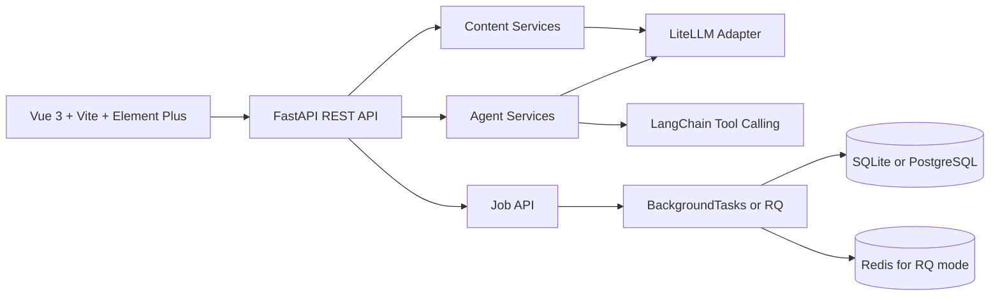

# AI Content Ops SaaS Prototype

[English](README.md) | [简体中文](README.zh-CN.md)

AI Content Ops 是一个面向内容运营团队的可演示 SaaS 原型。项目把 Vue 3 工作台、FastAPI 后端、多模型路由、四阶段内容 Agent 流程、持久化工具型对话 Agent，以及基于任务的内容工作流组合成一个完整闭环。

这个项目更适合作为 AI 全栈工程作品集项目：重点展示产品思考、Agent 编排、模型接入、API 契约测试和前后端联动，而不是把它描述成已经成熟商用的 SaaS。

## 产品范围

当前版本围绕一条实用的内容运营主流程展开：

- 内容工作台：运行 Strategy / Writer / Editor / Review 四阶段 Agent 流程，并保存最终稿。
- Agent 对话：支持模型选择、线程持久化和工具调用记录。
- 内容库：查看历史内容和生成版本。
- 内容打磨：对已有内容进行改写、换风格并保存新版本。
- 发布日历：为内容安排未来发布时间。
- 统计分析：查看内容类型和状态分布。
- 模型控制台：通过同一套 API 使用 Claude、SiliconFlow、DeepSeek、Moonshot。

## 商业化边界

这个仓库是一个适合演示和面试的 SaaS 原型。

当前版本不包含生产级登录、团队权限、计费、多租户隔离、云部署或真实发布平台集成。这些是后续商业化方向，但不在当前实现范围内，这样可以保证项目表述准确、代码可审查、运行门槛可控。

## 技术架构



核心目录：

- `frontend/`: Vue 3 前端、Element Plus 界面、基于轮询的任务流和内容/模型 API client。
- `src/api/`: FastAPI 路由、schema、服务层、依赖注入和契约测试接口。
- `src/api/services/agent_pipeline.py`: 四阶段 Agent 流程，负责策略、初稿、润色和审核。
- `src/api/services/chat_agent.py`: 持久化的工具型对话 Agent。
- `src/api/routes/jobs.py`: 工作台和打磨页使用的异步任务接口。
- `src/jobs/`: 队列适配层和共享任务执行器，兼容 background 模式和 RQ worker。
- `src/llm/`: 基于 LiteLLM 的多 provider 适配。
- `src/storage/content_store.py`: SQLAlchemy 持久化内容、日历、统计、Agent 会话和任务状态。
- `tests/`: 健康检查、任务接口、内容生成、Agent 流程、对话持久化、工具事件和模型列表的契约测试。

## 运行模式

项目目前支持两种实际可用的启动方式：

### 1. 本地 SQLite 模式

适合本地开发、演示和轻并发场景。

- 数据库：SQLite
- 队列模式：FastAPI `BackgroundTasks`
- 不需要 Redis worker

现成配置文件：

- `.env.sqlite`

### 2. PostgreSQL + Redis 高并发模式

适合希望 API 保持响应，而较长的 LLM 任务转后台执行的场景。

- 数据库：PostgreSQL
- 队列模式：Redis + RQ
- 需要单独启动 `worker.py`

现成配置文件：

- `.env.postgres-rq`

额外部署说明见 [DEPLOYMENT.md](DEPLOYMENT.md)。

## 通用安装

环境要求：

- Python 3.10+
- Node.js 18+
- 如果你要在本地起 PostgreSQL + Redis，需要 Docker Desktop
- 如果要调用真实模型，至少需要配置一个可用的 LLM provider API key。演示数据脚本不会调用外部模型。

安装后端依赖：

```bash
python -m venv .venv

# Windows PowerShell
.\.venv\Scripts\Activate.ps1

# macOS / Linux
source .venv/bin/activate

python -m pip install -r requirements.txt
```

安装前端依赖：

```bash
cd frontend
npm install
cd ..
```

## 使用 SQLite 启动

先复制本地开发配置：

```bash
# PowerShell
Copy-Item .env.sqlite .env

# macOS / Linux
cp .env.sqlite .env
```

然后把 `.env` 里对应 provider 的 API key 填好。

可选：导入演示数据，不调用任何外部 LLM：

```bash
python examples/seed_demo_data.py
```

启动后端：

```bash
python server.py
```

在第二个终端启动前端：

```bash
cd frontend
npm run dev
```

说明：

- SQLite 数据默认保存在 `data/content_ops.db`
- SQLite 模式下不要启动 `python worker.py`
- Agent 和内容任务会通过 FastAPI 的 background tasks 执行

## 使用 PostgreSQL + Redis 启动

先复制高并发配置：

```bash
# PowerShell
Copy-Item .env.postgres-rq .env

# macOS / Linux
cp .env.postgres-rq .env
```

然后把 `.env` 里对应 provider 的 API key 填好。

启动 PostgreSQL 和 Redis：

```bash
docker compose up -d postgres redis
```

启动 API：

```bash
python server.py
```

如果你是在 Linux 或 WSL 环境，也可以用多 worker 方式跑 API：

```bash
gunicorn -k uvicorn.workers.UvicornWorker src.api.main:app --workers 4 --bind 0.0.0.0:8000
```

在另一个终端启动 RQ worker：

```bash
python worker.py
```

再启动前端：

```bash
cd frontend
npm run dev
```

说明：

- 仓库里的 `docker-compose.yml` 只会启动 PostgreSQL 和 Redis，不会自动把 API 和前端一起容器化
- Windows 下 `worker.py` 会自动使用 RQ `SimpleWorker`
- 如果 Redis 没启动，执行 `python worker.py` 出现连接错误是符合预期的

## 前端配置

前端开发代理配置参考 `frontend/.env.example`，默认代理到：

```env
VITE_API_PROXY_TARGET=http://localhost:8000
```

API 端口通过根目录 `.env` 配置，前端开发端口通过 `frontend/vite.config.ts` 调整。

## 验证命令

```bash
python -m pytest tests -q
python -m compileall src tests examples

cd frontend
npm run build
```

## API 接口

同步接口：

- `GET /api/health`: 健康检查。
- `GET /api/models`: 获取 provider 和模型列表。
- `POST /api/agent/run`: 直接执行四阶段内容 Agent 流程。
- `POST /api/agent/chat`: 执行持久化工具型对话 Agent。
- `GET /api/agent/threads`: 获取持久化会话列表。
- `GET /api/agent/threads/{thread_id}/messages`: 获取单个会话消息。
- `DELETE /api/agent/threads/{thread_id}`: 删除持久化会话。
- `GET /api/content`: 获取内容列表。
- `GET /api/content/{content_id}`: 获取单条内容。
- `POST /api/content/generate`: 直接生成并保存内容。
- `POST /api/content/refine`: 直接打磨并保存内容版本。
- `POST /api/content/titles`: 生成标题候选。
- `POST /api/content/seo`: 生成 SEO 建议。
- `GET /api/calendar/events`: 查看发布日历。
- `POST /api/calendar/events`: 创建发布日程。
- `GET /api/stats`: 查看内容类型和状态统计。

任务接口：

- `POST /api/jobs/content-generation`: 创建内容生成任务。
- `POST /api/jobs/agent-run`: 创建四阶段 Agent 流程任务。
- `POST /api/jobs/refine`: 创建内容打磨任务。
- `POST /api/jobs/titles`: 创建标题生成任务。
- `POST /api/jobs/seo`: 创建 SEO 分析任务。
- `GET /api/jobs/{job_id}`: 查询任务状态和结果。

## 简历定位

这个项目更适合作为 AI 全栈工程案例，而不是成熟商业 SaaS 的宣传材料。推荐关键词包括 Agent orchestration、tool-calling Agent、LLM integration、multi-provider model routing、FastAPI、Vue 3、SQLAlchemy、Redis、RQ 和 contract tests。

简历版项目描述见 [RESUME.md](RESUME.md)，3 到 5 分钟面试演示路线见 [DEMO.md](DEMO.md)。
