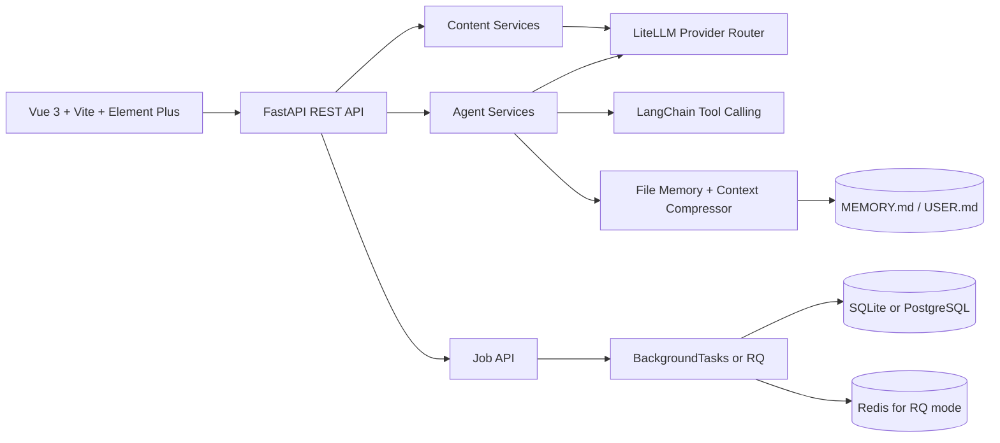

# AI Content Ops Agent

[English](README.md) | [简体中文](README.zh-CN.md)


AI Content Ops Agent 是一个围绕内容运营工作流构建的 AI 全栈原型。它把
FastAPI、Vue 3、LiteLLM、LangChain 工具调用、SQLAlchemy 存储、Docker
部署和单管理员登录保护组合成一个可以演示、可以运行、也方便审查的产品表面。

这个仓库更适合作为 AI 全栈工程作品集项目：它展示的是产品思考、API 契约、
Agent 编排、后台任务、前端工作流和部署工程，而不是声称自己已经是成熟的
多租户商业 SaaS。

## 项目能力

| 模块 | 能力 |
| --- | --- |
| 内容工作台 | 动态 plan-then-execute 内容流水线，包含 researcher、strategy、writer、editor、reviewer、fact-checker 等子 Agent。 |
| Chat Agent | 持久化工具型对话助手，支持线程历史、内容工具、规划工具、记忆工具和会话搜索。 |
| 内容库 | 保存草稿、打磨版本、媒体素材、本地发布记录和可搜索历史。 |
| 内容打磨 | 对已保存内容进行改写或优化，并保留来源关系。 |
| 发布日历 | 未来 60 天发布队列、单日议程和平台分布汇总。 |
| 统计分析 | 更专业的内容类型/状态分布分析页和结构判断。 |
| 长期记忆 | Hermes 风格文件记忆：`MEMORY.md`、`USER.md`、上下文压缩和 curator。 |
| Docker | 一套 Compose 启动前端、API、worker、PostgreSQL 和 Redis。 |

## 技术架构



核心目录：

| 路径 | 作用 |
| --- | --- |
| `frontend/` | Vue 3 前端、Element Plus 界面、模型/内容 API client、轮询和 SSE 流。 |
| `src/api/` | FastAPI 路由、schema、服务层、依赖注入和鉴权中间件。 |
| `src/api/services/dynamic_pipeline.py` | 工作台的动态计划和执行流水线，事件通过数据库持久化并用 SSE 推送。 |
| `src/api/services/chat_agent.py` | 持久化工具型 Chat Agent，以及长期记忆集成。 |
| `src/api/services/sub_agents.py` | Researcher、Fact Checker、Writer、Editor、Reviewer 和 Strategy 子 Agent。 |
| `src/tools/web_search.py` | 多来源网页搜索：Serper、Tavily、Brave、SearXNG、DuckDuckGo 和 Bing fallback。 |
| `src/jobs/` | 队列适配层和共享任务执行器，兼容 BackgroundTasks 与 RQ。 |
| `src/storage/content_store.py` | SQLAlchemy 模型和 CRUD，覆盖内容、任务、运行事件、素材、日历和消息。 |
| `tests/` | API、任务、Agent、鉴权、搜索、记忆、素材和存储相关测试。 |

## 两套 Agent 表面

项目里故意保留了两套不同的 Agent 设计：

| 表面 | 接口 | 工具权限 | 使用场景 |
| --- | --- | --- | --- |
| 动态工作台流水线 | `/api/agent/runs` | 只有 researcher 和 fact-checker 可以使用只读/搜索工具。 | 通过受控多步骤流程生产结构化内容。 |
| Chat Agent | `/api/agent/chat` | 完整内容运营工具集，写入类工具有安全约束。 | 对话式运营、选题规划、内容打磨、排期和记忆更新。 |

这个区分是有意的。流水线不应该随便修改内容库或日历；Chat Agent 可以用写入类工具，但系统 prompt 会要求在副作用操作前先得到用户确认，除非用户一开始就明确要求立即执行。

## Docker 快速启动

想直接跑完整项目，优先使用 Docker。Docker 模式会一起启动前端、API、worker、
PostgreSQL 和 Redis，是体验完整产品最省事的方式。

1. 创建本地 `.env` 文件：

```powershell
# Windows PowerShell
Copy-Item .env.docker.example .env
```

```bash
# macOS / Linux
cp .env.docker.example .env
```

2. 编辑 `.env`，至少填写一个 LLM provider key：

```env
LLM_PROVIDER=deepseek
DEEPSEEK_API_KEY=your_deepseek_key_here
```

可选但推荐：

```env
# 稳定的 researcher / fact-checker 网页搜索
SERPER_API_KEY=
TAVILY_API_KEY=
BRAVE_SEARCH_API_KEY=

# 登录保护
AUTH_ENABLED=true
AUTH_USERNAME=admin
AUTH_PASSWORD=change_me
AUTH_SECRET_KEY=replace_with_a_long_random_secret
```

3. 启动完整栈：

```bash
docker compose up -d --build
```

4. 检查服务状态：

```bash
docker compose ps
```

5. 打开：

- 前端：`http://localhost:8088`
- API：`http://localhost:8000`

Docker 模式会启动：

| 服务 | 作用 |
| --- | --- |
| `frontend` | Nginx 托管 Vue 构建产物，并把 `/api` 代理到 API 服务。 |
| `api` | FastAPI 应用。 |
| `worker` | RQ worker，处理长耗时任务。 |
| `postgres` | PostgreSQL 16 数据库。 |
| `redis` | RQ 使用的 Redis。 |

常用命令：

```bash
docker compose ps
docker compose logs -f api
docker compose logs -f worker
docker compose down
```

修改 `.env` 后，需要重建/重启相关容器，让新环境变量生效：

```bash
docker compose up -d --force-recreate api worker
```

如果改了前端或 Nginx 配置，也重建前端：

```bash
docker compose up -d --build frontend
```

## 必要配置

复制一个 env 模板为 `.env`，然后按需填写 key。

| 场景 | 需要配置 |
| --- | --- |
| 调用真实 LLM | 至少填写一个 provider key，例如 `DEEPSEEK_API_KEY`、`ANTHROPIC_API_KEY`、`SILICONFLOW_API_KEY`、`MOONSHOT_API_KEY` 或 `NEWAPI_API_KEY`。 |
| 稳定网页调研 | 填写 `SERPER_API_KEY`、`TAVILY_API_KEY` 或 `BRAVE_SEARCH_API_KEY` 任意一个。不填时会退回无 key HTML 搜索，可能被搜索引擎反爬。 |
| 登录保护 | 设置 `AUTH_ENABLED=true`，并填写 `AUTH_USERNAME`、`AUTH_PASSWORD` 和强随机 `AUTH_SECRET_KEY`。 |
| 小红书发布演示 | 保持或修改 `XHS_MCP_URL`，指向本机 MCP 服务。 |

Docker 会自动读取根目录 `.env`。如果是宿主机开发，可使用：

- `.env.sqlite`：SQLite + FastAPI `BackgroundTasks`
- `.env.postgres-rq`：PostgreSQL + Redis + RQ

## 本地开发

环境要求：

- Python 3.10+
- Node.js 18+
- 如果要启动 PostgreSQL、Redis 或完整 Compose 栈，需要 Docker Desktop

安装后端依赖：

```bash
python -m venv .venv

# Windows PowerShell
.\.venv\Scripts\Activate.ps1

# macOS / Linux
source .venv/bin/activate

python -m pip install -r requirements.txt
```

安装前端依赖：

```bash
cd frontend
npm install
cd ..
```

### SQLite 模式

SQLite 是最简单的宿主机开发模式。

```bash
# Windows PowerShell
Copy-Item .env.sqlite .env

# macOS / Linux
cp .env.sqlite .env
```

启动后端：

```bash
python server.py
```

另开一个终端启动前端：

```bash
cd frontend
npm run dev
```

说明：

- SQLite 数据默认保存在 `data/content_ops.db`
- SQLite 模式下不要启动 `python worker.py`
- 任务通过 FastAPI background tasks 执行

### PostgreSQL + Redis 模式

如果希望 API 进程和长任务分离，使用这个模式。

```bash
# Windows PowerShell
Copy-Item .env.postgres-rq .env

# macOS / Linux
cp .env.postgres-rq .env
```

启动基础设施：

```bash
docker compose up -d postgres redis
```

启动 API：

```bash
python server.py
```

另开终端启动 worker：

```bash
python worker.py
```

启动前端：

```bash
cd frontend
npm run dev
```

Windows 下 `worker.py` 会自动使用 RQ `SimpleWorker`，因为默认 fork 型 worker 依赖 Unix `os.fork()`。

## 长期记忆

Chat Agent 内置了一个参考 Hermes agent-curated memory 思路的四层记忆系统。

| 层 | 位置 | 行为 |
| ---: | --- | --- |
| 1 | `data/memory/MEMORY.md` 和 `data/memory/USER.md` | 小型 markdown 文件，带硬字符上限。`MEMORY.md` 存项目和工具笔记，`USER.md` 存用户偏好。 |
| 2 | Chat Agent prompt | 每个 thread 开始时读取一次并冻结到系统 prompt。写入操作下个 session 才生效。 |
| 3 | `src/agent/memory_curator.py` | 删除 thread 时可触发 curator，提出 add、replace、remove 操作。 |
| 4 | `src/agent/context_compressor.py` | 长会话会被压缩成结构化 checkpoint，同时保护 tool-call/result 配对不被切开。 |

主要环境变量：

```env
MEMORY_ENABLED=true
MEMORY_DIR=data/memory
MEMORY_MD_LIMIT=2200
USER_MD_LIMIT=1375
CONTEXT_COMPRESS_ENABLED=true
CONTEXT_COMPRESS_TRIGGER_MESSAGES=30
MEMORY_CURATOR_ENABLED=true
```

前端的记忆管理页可以直接编辑 `MEMORY.md` 和 `USER.md`，显示字符预算，并刷新 frozen snapshot。

## 验证命令

后端：

```bash
python -m pytest tests -q
python -m compileall src tests examples
```

前端：

```bash
cd frontend
npm run build
```

Docker：

```bash
docker compose up -d --build
docker compose ps
```

## 项目边界

这是一个可演示的工程原型，不是已经完全加固的商业 SaaS。

已经包含：

- 单管理员登录保护
- 本地 Docker 部署
- SQLite 或 PostgreSQL 存储
- Redis/RQ worker 模式
- 多 provider LLM 路由
- Agent 工具调用和工具轨迹
- 文件型记忆和会话搜索

暂不包含：

- 团队账号和 RBAC
- 计费
- 多租户隔离
- 生产级社交账号运营
- 云部署托管清单
- 企业审计日志

小红书发布路径是本地 MCP 驱动的工作流演示，适合产品和工程评审，但在投入生产前还需要进一步加固。

更多部署说明见 [DEPLOYMENT.md](DEPLOYMENT.md)。
